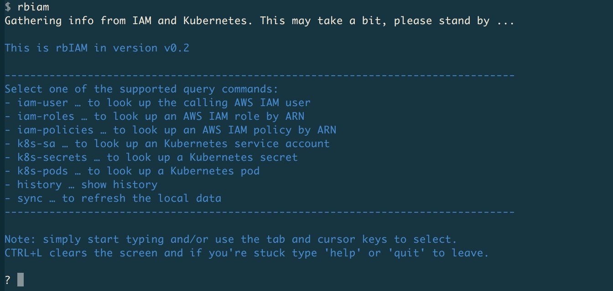
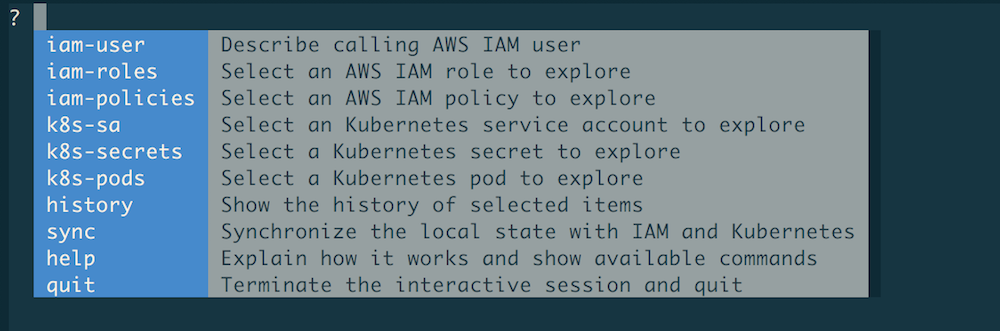
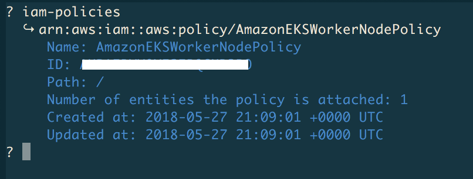
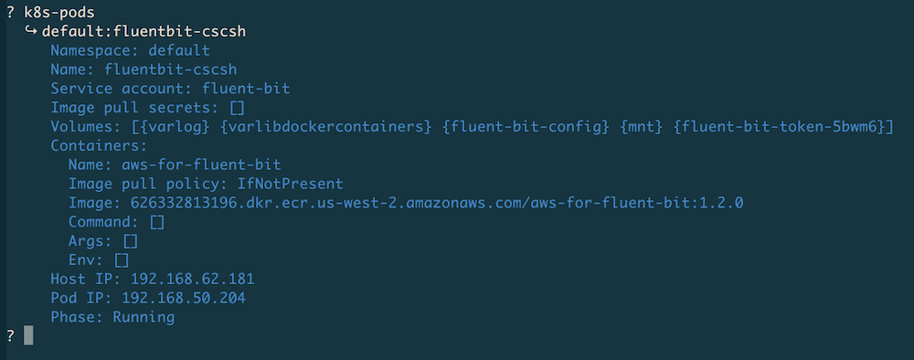
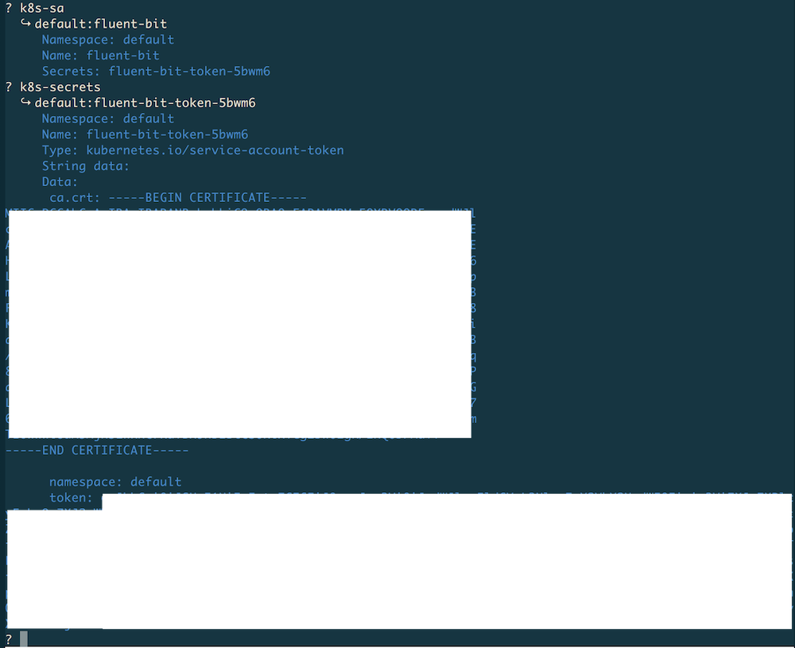

# Getting Started

This guide walks you through the setup and usage of `rbIAM`.


## Prerequisites

In order for you to use `rbIAM`, the following must be true:

- You have credentials for AWS configured.
- You have access to an EKS cluster or in general an Kubernetes-on-AWS cluster.
- You have `kubectl` [installed](https://kubernetes.io/docs/tasks/tools/install-kubectl/).

## Install

!!! warning
    This tool is still WIP and currently the CLI binaries are available only for macOS and Linux platforms. Please [raise an issue on GitHub](https://github.com/mhausenblas/rbIAM/issues?q=is%3Aissue+is%3Aopen+sort%3Aupdated-desc) if you're experiencing problems or something does not quite work like described in here.

To install `rbIAM`, execute the following two commands. First, download
the respective binary (here shown for macOS) like so:

```sh
curl -L https://github.com/mhausenblas/rbIAM/releases/latest/download/rbiam-macos -o /usr/local/bin/rbiam
```

And then make it executable:

```sh
chmod +x /usr/local/bin/rbiam
```

!!! tip
    For Linux install, simply replace the `-macos` part with `-linux`

Alternatively, you can download the binaries from the [releases](https://github.com/mhausenblas/rbIAM/releases) page on GitHub.

## Usage

The following lists the commands `rbIAM` supports and then walks you through an example usage, end-to-end.

### Commands

The available commands in `rbIAM` v0.2 are:

1. General:
    * `history` … lists the history of selected items
    * `sync` … synchronizes the local state with the remote one from IAM and Kubernetes
    * `help` … lists available commands and provides usage tips
    * `quit` … terminates the interactive session and quits the program
  
2. For exploring AWS IAM:
    * `iam-user` … allows you to describe the calling AWS IAM user details
    * `iam-roles` … allows you to select an AWS IAM role and describe its details
    * `iam-policies` … allows you to select an AWS IAM policy and describe its details
3. For exploring Kubernetes RBAC:
    * `k8s-pods` … allows you to select a Kubernetes pod and describe its details
    * `k8s-sa` … allows you to select an Kubernetes service accounts and describe its details
    * `k8s-secrets` … allows you to select a Kubernetes secret and describe its details

### Walkthrough

In the following we do an end-to-end walkthrough, showing `rbIAM` in action.

#### Launching & terminating

After you launch the tool by typing `rbiam` in the shell of your choice, you should see something like this:

{: style="width:95%; display: block; margin: 10px auto 50px auto; padding: 1px; -webkit-box-shadow: -2px 0px 10px 0px rgba(0,0,0,0.4); -moz-box-shadow: -2px 0px 18px 0px rgba(0,0,0,0.4); box-shadow: -2px 0px 18px 0px rgba(0,0,0,0.4);"}

On startup, `rbiam` queries both IAM and Kubernetes to get all the pertinent info, from the point of view of the authenticated user. This can take a couple of seconds, and if anything changes, for example you created a new secret in Kubernetes or attached a new policy to a role, you can use the `sync` command to manually trigger this process.

Now, use the `TAB` key or → (right arrow key) to display the top-level menu:

{: style="width:95%; display: block; margin: 10px auto 50px auto; padding: 1px; -webkit-box-shadow: -2px 0px 10px 0px rgba(0,0,0,0.4); -moz-box-shadow: -2px 0px 18px 0px rgba(0,0,0,0.4); box-shadow: -2px 0px 18px 0px rgba(0,0,0,0.4);"}

!!! note
    Select any of the commands by navigating with the `TAB`/→ key or by start typing.
    When you start typing, only commands starting with said prefix are shown. For example,
    if you type `iam`, then the menu reduces to `iam-user`, `iam-roles` , and `iam-policies`.

Once you're done, you want to terminate `rbIAM`. To do so, start typing `q` and auto-complete 
it with `TAB` so that the `quit` command appears and when hitting `ENTER` you then execute said 
command and terminate the program.

!!! tip
    In order to clear the screen, you can hit `CTRL+L`.

Now that we know how to launch and terminate `rbIAM`, let's look something up.

#### Querying IAM user info { #markdown data-toc-label='IAM user info' }

To learn about the logged in AWS user and their caller identity, use the `iam-user` command:

{: style="width:95%; display: block; margin: 10px auto 50px auto; padding: 1px; -webkit-box-shadow: -2px 0px 10px 0px rgba(0,0,0,0.4); -moz-box-shadow: -2px 0px 18px 0px rgba(0,0,0,0.4); box-shadow: -2px 0px 18px 0px rgba(0,0,0,0.4);"}

Above, we've hidden certain sensitive info but, naturally, when you execute the
command you'll see the actual values.

#### Exploring IAM roles & policies { #markdown data-toc-label='IAM roles &policies' }

If you want to learn about AWS roles, use the `iam-roles` command. Once selected, 
you will see a list of IAM roles you can select from or start typing to filter down 
the list. For example, here we used `eksctl` to filter down the list to two entries 
and then selected one for exploration with `ENTER`:

{: style="width:95%; display: block; margin: 10px auto 50px auto; padding: 1px; -webkit-box-shadow: -2px 0px 10px 0px rgba(0,0,0,0.4); -moz-box-shadow: -2px 0px 18px 0px rgba(0,0,0,0.4); box-shadow: -2px 0px 18px 0px rgba(0,0,0,0.4);"}

!!! tip
    In order to clear the term to the left of the cursor, you can hit `CTRL+W`.

Further, lo learn about AWS policies, use the `iam-policies` command like so:

{: style="width:95%; display: block; margin: 10px auto 50px auto; padding: 1px; -webkit-box-shadow: -2px 0px 10px 0px rgba(0,0,0,0.4); -moz-box-shadow: -2px 0px 18px 0px rgba(0,0,0,0.4); box-shadow: -2px 0px 18px 0px rgba(0,0,0,0.4);"}

Now that we've covered the IAM side of the house, let's move on to RBAC.

#### Exploring Kubernetes pods { #markdown data-toc-label='Kubernetes pods' }

Starting off with the app of interest, you want to find the Kubernetes pod hosting it.
For this, use the `k8s-pods` command as follows:

{: style="width:95%; display: block; margin: 10px auto 50px auto; padding: 1px; -webkit-box-shadow: -2px 0px 10px 0px rgba(0,0,0,0.4); -moz-box-shadow: -2px 0px 18px 0px rgba(0,0,0,0.4); box-shadow: -2px 0px 18px 0px rgba(0,0,0,0.4);"}

Now that we have the pod info, we can continue with the service account we found
here, in this case, it's the one named `fluent-bit`.

#### Exploring Kubernetes service accounts & secrets { #markdown data-toc-label='Kubernetes service accounts' }

To explore Kubernetes service accounts and their secrets, use the `k8s-sa` and 
the `k8s-secrets` command, respectively. From the previous step we've gathered
that for the Fluent Bit pod we're interested in the service account `fluent-bit`, 
so let's look this up along with its secret:

{: style="width:95%; display: block; margin: 10px auto 50px auto; padding: 1px; -webkit-box-shadow: -2px 0px 10px 0px rgba(0,0,0,0.4); -moz-box-shadow: -2px 0px 18px 0px rgba(0,0,0,0.4); box-shadow: -2px 0px 18px 0px rgba(0,0,0,0.4);"}

!!! note
    Values in secrets are `base64` encoded, however `rbIAM` automatically converts
    them into clear text so that you can directly copy & paste them. For example,
    in the case shown above, the value of `ca.cert` would be the actual content of
    the certificate.

At any point you can use the `history` command to list the selected items in
reverse chronological order. In our case this would be `fluent-bit-token-5bwm6`,
`fluent-bit`, and `fluent-bit-cscsh`.