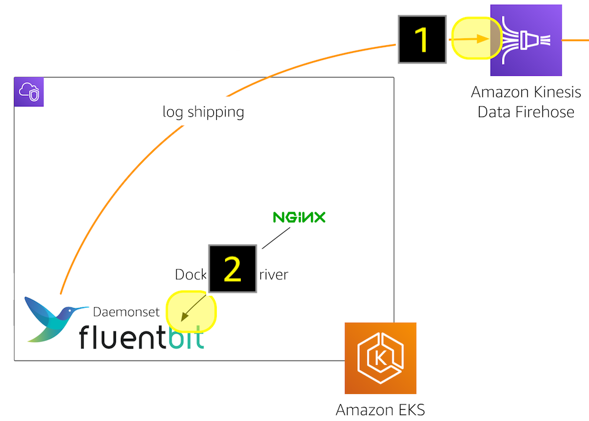
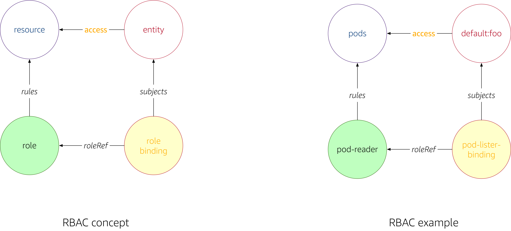

# Overview

When using Amazon Elastic Kubernetes Service ([EKS](https://aws.amazon.com/eks/)) you will at some point ask yourself: how does AWS Identity and Access Management ([IAM](https://aws.amazon.com/iam/)) and Kubernetes Role-based access control ([RBAC](https://kubernetes.io/docs/reference/access-authn-authz/rbac/)) play together. Do they overlap? Are they complementary? Are there dependencies.

`rbIAM` aims to help you navigate this space.

## Motivation 

Let's have a look at a concrete example, for motivation. Take the [Fluent Bit output plugin for Amazon Kinesis Data Firehose](https://github.com/aws/amazon-kinesis-firehose-for-fluent-bit). In [Centralized Container Logging with Fluent Bit](https://aws.amazon.com/blogs/opensource/centralized-container-logging-fluent-bit/) we described how to use it. The setup, in a nutshell, is as follows:

The Fluent Bit is deployed as a `DaemonSet` as per [eks-fluent-bit-daemonset.yaml](https://github.com/aws-samples/amazon-ecs-fluent-bit-daemon-service/blob/master/eks/eks-fluent-bit-daemonset.yaml) and:

1. depends on an IAM policy, defined in [eks-fluent-bit-daemonset-policy.json](https://github.com/aws-samples/amazon-ecs-fluent-bit-daemon-service/blob/master/eks/eks-fluent-bit-daemonset-policy.json), giving it the permissions to write to the Kinesis Data Firehose, manage log streams in CloudWatch, etc., as well as
1. a Kubernetes role, defined in [eks-fluent-bit-daemonset-rbac.yaml](https://github.com/aws-samples/amazon-ecs-fluent-bit-daemon-service/blob/master/eks/eks-fluent-bit-daemonset-rbac.yaml), giving it the permissions to list and query pods and namespaces, in the cluster, so that it can receive the logs from the containers.

## Terminology

### IAM

Principal, role, policy, STS

### RBAC

User, service account, role, role binding

